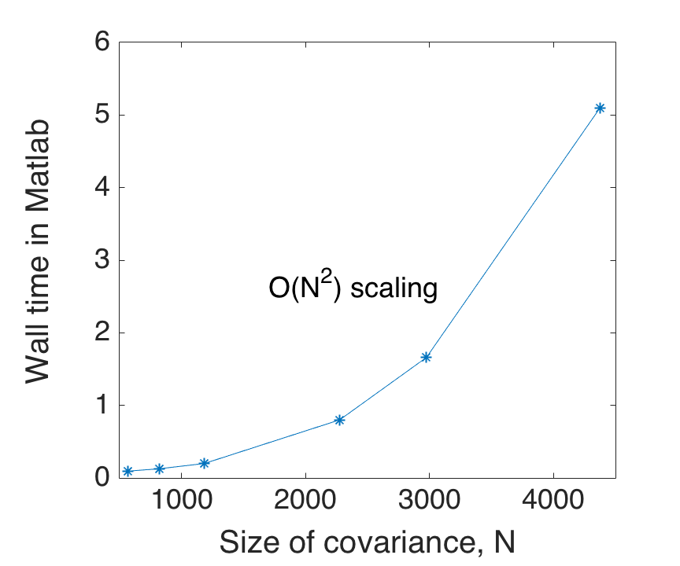
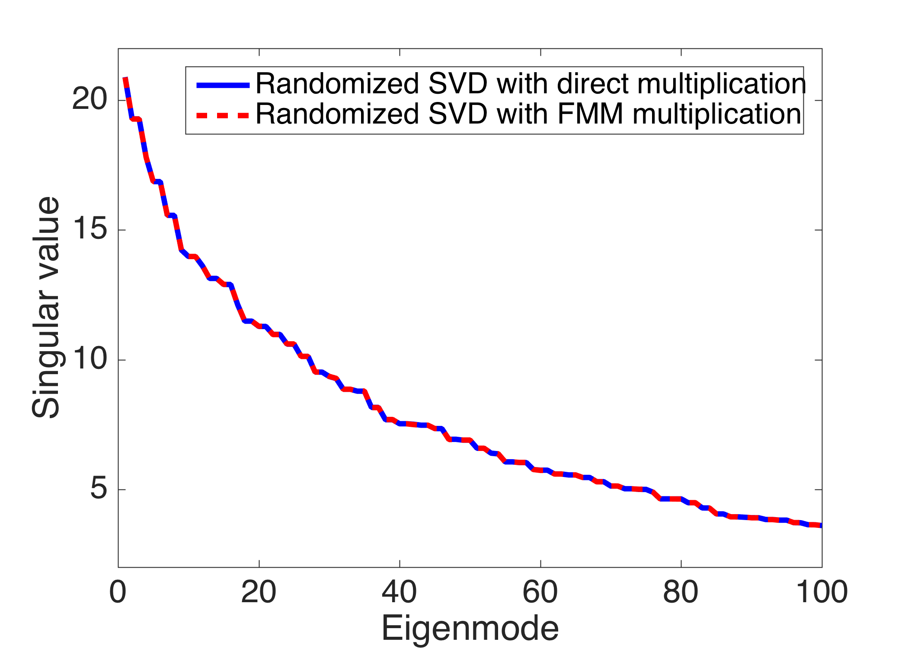
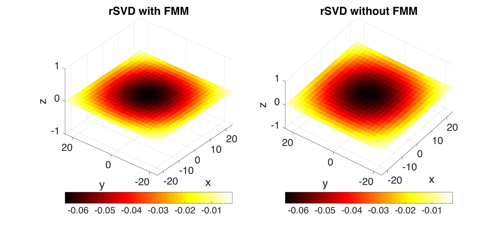
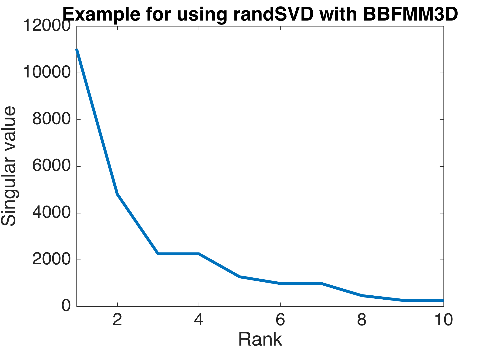
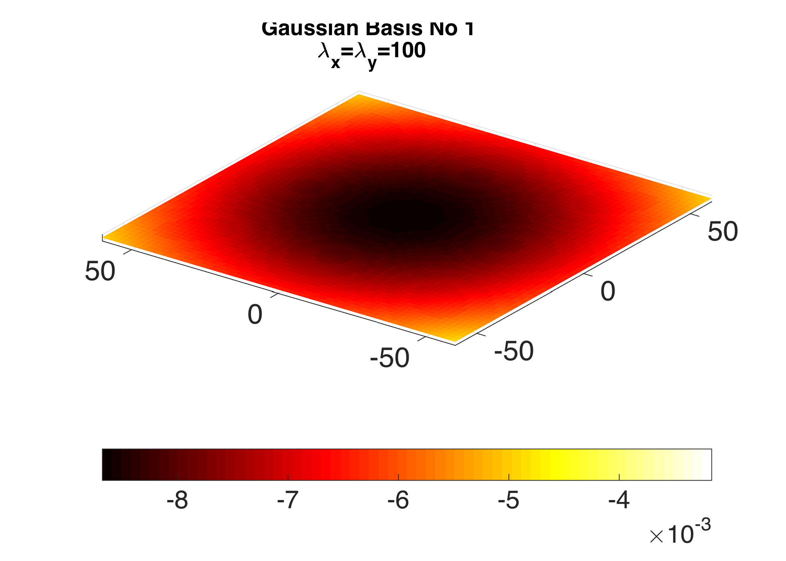

##Quick Start Guide for mexBBFMM3D, a fast matrix multiplication package for inversion 
**Bonus**: randomized SVD example using mexBBFMM3D 

----------------

## Summary 

This package includes instructions and set-up information for using mexBBFMM3D, a method for **fast matrix-matrix multiplication**. The package is intended for, but not limited to, use within inversion codes that require multiplication of large covariance matrices with other vectors or matrices. Examples are provided. Also, we include an application of the package to performing matrix decomposition using randomized SVD. Comparison files are provided for showcasing the efficiency of the provided algorithm. 

Other important applications of the BBFMM3D package include multiplication of more generic matrices A with vector x, where A is given by a kernel of the form  `A_ij = K(r_i - r_j)`
where `(r_i,r_j)` are given points in 3D, as well as for calculation of the square root of a matrix: `A = B^2`, for A symmetric positive definite. For more information on more advanced applications see   [here](https://github.com/ruoxi-wang/BBFMM3D).

###Functions and nomenclature
1. BBFMM3D: C++ code for performing fast (linear) multiplication of a kernel matix Q with a vector or matrix: P = QH

2. mexBBFMM3D: Matlab interface for BBFMM3D. 

3. randSVD: Code to perform approximate singular value decomposition of covariance matrix to obtain the first N eigenvectors and eigenvalues. The method includes matrix-matrix multiplications. In the standrard version, these multiplications are performed with straight matrix-matrix multiplication.

4. randSVD with mexBBFMM3D: Performs approximate singular value decomposition for large covariance kernels Q. BBFMM3D is used to accelerate matrix-matrix multiplications of the Q matrix with random vectors within the randSVD code. 

###Disclaimer

This is a quick-start guide with instructions on how to set up and use mexBBFMM3D in MATLAB, with two example m-files that can be used to perform matrix-vector and matrix-matrix multiplication for regular and irregular grids, and with examples for running randomized SVD with and without BBFMM3D. A reasonably good knowledge of MATLAB is assumed and minimal understanding of the FMM and randomized SVD theory is needed.  

 For a full description of the FMM algorithm see [Fong and Darve 2009] in section [__Reference__](#ref), and for the C++ code, see the BBFMM3D page  [here](https://github.com/ruoxi-wang/BBFMM3D). The corresponding code for 2D cases can be found [here](https://github.com/judithyueli/mexBBFMM2D).

In this guide, we will demonstrate BBFMM3D with an example of multiplication of a Gaussian covariance matrix Q (termed as Gaussian kernel) with a matrix H, and we will then apply randSVD of the Gaussian kernel for a small and large case, with and without BBFMM3D respectively.  The methods given here can also be applied for other smooth kernels (see section [__Appendix__](#ref_app)).

If you use this code, please cite the following <a href="http://www.sciencedirect.com/science/article/pii/S0021999109004665">paper</a> : Fong, William, and Eric Darve. "The black-box fast multipole method." Journal of Computational Physics 228, no. 23 (2009): 8712-8725. 

###2. DIRECTORIES AND FILES


	./example1.m		:	Example of how to use mexBBFMM3D for isotropic, 
							regular grid
	./example2.m		:	Example of how to use mexBBFMM3D for anisotropic, 
							irregular grid 
	./make.m		    :	Makefile 
	./include/	    	:	Relevant header files  
	./mexFMM3D.cpp	    :	mex function  
	./eigen/	    	:	Eigen Library  
	./BBFMM3D/   		: 	BBFMM3D library
	./README.md	    	:	This file  
	./Troubleshooting.md:   Instructions for troubleshooting compilation problems
	./RandSVDBBF3D.m    :   Function for performing randSVD for large 
							covariance matrices using BBFMM
	./RandSVD.m         :   Function for performing randSVD for small 
							covariance matrices
	./cov_reg.m         :   Function to create covariance matrix on a regular grid
	./cov_irg.m         :   Function to create covariance matrix for irregular grid
	./plotU.m			:   Function to plot U columns obtained from SVD in 3D


## BBFMM3D

###Overview
The Fast Multipole Method (FMM) is an algorithm that performs fast multiplication of an N x N dense matrix Q(x,y) where N is the number of unknown values at points (x,y) in a 2D domain, with a matrix H of size N x m (N>>m). The direct multiplication approach has complexity O(N^2), while the BBFMM3D has linear complexity O(N). The BBFMM3D algorithm uses Chebyshev interpolation to approximate the multiplication. The approximation error can be controlled by the number of Chebyshev nodes used, which can be adjusted to achieve the desired accuracy. mexBBFMM3D provides a Matlab interface for the BBFMM3D package, which is written in C++. Note that the C++ code is faster than the Matlab interface. 

The table below shows computation times on a single core CPU when using the mexBBFMM3D package and when using direct multiplication.

|   N      |  Time for BBFMM3D (sec)  |  Time for direct multiplication (sec) |   
| -------: |:------------------------:|:-------------------------------------:| 
| 12,500   |                       4.3|  22.8                                 |
| 50,000   |                      5.27|  367.9                                |
| 100,000  |                       9.6|  1505.3                               |


	
###Setting up mex and compilation

####Step 1:  Download and be aware of supporting software

You will need the following supporting software: 

* The Fast Fourier Transform library, which can be downloaded [here](http://www.fftw.org/fftw-2.1.5.tar.gz). Simply download it for now and read on.
* Matlab [SDK files](http://www.mathworks.com/products/matlab-compiler-sdk/). What you need to do depends on the error messages you will get when following these instructions. See Troubleshooting.md for more.
* Xcode patch for Mac users: If you have upgraded to Xcode 7, see [Answer](http://www.mathworks.com/matlabcentral/answers/246507-why-can-t-mex-find-a-supported-compiler-in-matlab-r2015b-after-i-upgraded-to-xcode-7-0) by MathWorks Support Team on 28 Dec 2015 on how to install the patch.

####Step 2:  Check if you have MEX and MATLAB Symbolic Math Toolbox set up in Matlab

The mexBBFMM3D package relies on MATLAB MEX functions and the MATLAB Symbolic Math Toolbox. In order to use MEX functions, you should setup mex.

Setup MEX by typing the following MATLAB command:

```
mex -setup  
```

Once mex is set up successfully, to ensure that  MEX is installed, try the following commands:

```
copyfile([matlabroot,'/extern/examples/mex/arraySize.c'],'./','f')     
mex -v arraySize.c     
arraySize(5000) 

```

The last two lines of the screen output should read:  

```
Dimensions: 5000x5000
Size of  array in kilobytes: 24414
```

If you do not get this output, take a note of the error you get and refer to file __Trouble Shooting.md__ of this package.

####Step 3:  Download the code from [here](https://github.com/amaliak/randSVD-with-BBFMM3D)

A folder called `randSVD-with-BBFMM3D-master` will be downloaded when you click on the above link. Copy the folder `randSVD-with-BBFMM3D-master` to your specific working directory. In MATLAB, set the current folder to be the directory where the code is. You will see the folders
`BBFMM3D\` and `Eigen\`, as well as an m-file called (`compilemex.m`) and two example m-files (`example1.m` and `example2.m`) that we will use in this quick start quide. These m-files will be used to compile, set-up, test and use `BBFMM3D` to multiply matrices. You only need to change the input to the example functions. No modifications will be needed to other m-files or the contents of the folder `BBFMM3D` which includes the c++ source code. 


####Step 4: Compile the MEX file to make sure compilation works

__A.__ Open function `compilemex.m` and read the function description, or type `help compilemex`.

__B.__ Choose input for `compilemex(execname,kerneltype,corlength)`: give your BBFMM3D case a name, e.g. `Test1` and choose your kernel function type, e.g. `GAUSSIAN` and the correlation length. Then compile by giving the command: 

```
compilemex('Test1','GAUSSIAN',10)
```

This will compile the source code and generate a MEX-file with the name you provided (e.g. `Test1.mexmaci64`). The extension (`.mexmaci64`) will depend on your platform.

If compilation is successful, you should see the message:

 `mex compiling is successful!`. 
 
 You can ignore the warnings. If compilation is not successfull, note the error message and refer to file __Trouble Shooting.md__ of this package.


####Step 5: Run the examples

There are two autonomous examples provided, example1.m for a regular grid, and example2.m for an irregular grid. *The user does not need to change the code.* 

If you are only testing the code, we advise that you always operate in the main directory of mexBBFMM3D.

**Note for Advanced users**: 

If you intend to embed the code to your software:

* We advise you to go through the code of the examples and through the documentation of each function and contact us with any questions. 
* For the compilation, you have to operate in the main directory of mexBBFMM3D, which contains `make.m`. For use after compilation,  you can call the generated MEX-files (e.g., `ExecName.mexmaci64`) by moving them to your own working directory, or add the main directory of mexBBFMM3D to the path. 


#####Example1.m for a regular grid

Function `example1()` uses the mexBBFMM3D code to perform the multiplication of a 3D covariance matrix `Q` defined on a regular grid, with a matrix `H`. The function first compiles the code, and then uses the executable to perform the multiplication. 


__A.__ Open file `example1.m` and read instructions, or type `help example1` The example recompiles the code and then computes QH, if on `TestingMode`. If  `TestingMode=0` the last compiled executable is used to perform the multiplication. Compilation is always needed when the covariance kernel is changed.

__B.__ Choose input variables for `QH = example1(ExecName,grid,Kernel,corlength,H,TestingMode)`. Avoid using a very large grid while in `TestingMode`, because the code performs the direct multiplication for comparison and it may take a very long time to be completed. Note that for this example the grid must be provided as unique x,y and z locations and (x,y,z) triplets will be created automatically.


Input:
    - `ExecName` : the name of the mexfile for the Kernel chosen
    
    - `grid`     : structure with vectors grid.x, grid.y, grid.z each vector containing x,y and z coordinates respectively
    
    - `Kernel`   : covariance type, e.g. 'GAUSSIAN'
    
    - `corlength`: correlation length, isotropic anisotropy in z direction supported, see code
    
    - `H`       : matrix by which Kernel is multiplied
    
    - `TestingMode`: if set to 1, BBFMM is recompiled and runs in TestingMode in order to determine parameters (nCheb) for desired accuracy. if set to 0, the direct multiplication is not performed and the last compiled executable is used for BBFMM3D.

 Output:
    - `ExecName.mexmaci64`: executable for mex file for given configuration
    
    - `QH`       : Product of Kernel chosen by matrix H specified in input

Example usage: 

```
 grid.x = -62:4:62; grid.y = -62:4:62; grid.z = -9:3:9;
 QH = example1('TESTNAME',grid,'GAUSSIAN',50,ones(7168,1),1)
```
When run in TestingMode (`TestingMode = 1`), the output will give a relative error that compares the accuracy of BBFMM3D with the direct multiplication of Q*H. Example printout:

```
Starting FMM computation...

Pre-computation time: 1.9583
FMM computing time: 4.6788
FMM total time: 6.6370

Starting direct computation...
Direct calculation starts from: 0 to 0.
Exact computing time: 8.2686
Relative Error: 9.724730e-05
```

If the Relative Error is deemed low enough for your purposes, the code can be run with `TestingMode=0`, in which case the direct multiplication is not performed for comparison. Note that with `TestingMode=0`, the code will use the last compiled executable, even if otherwise specified in the input variables of the example. 

Example printout when `TestingMode = 0`: 

```
ExecName, Kernel, Corlength ignored
Using executable last compiled
------------------------------
Executable Name is TESTNAME
Kernel type is GAUSSIAN
Correlation length in x,y,z is 30

Starting FMM computation...

Pre-computation time: 0.0604
FMM computing time: 3.9679
FMM total time: 4.0283
```
#####Example2.m for an irregular grid with vertical anisotropy

Function `example2()` uses the mexBBFMM3D code to perform the multiplication of a 3D covariance matrix `Q` defined on an irregular grid, with a matrix `H`. The function first compiles the code, and then uses the executable to perform the multiplication. An example irregular grid is provided. 

__A.__ Open file `example2.m` and read instructions, or type `help example2` The example recompiles the code and then computes QH, if on `TestingMode`. If  `TestingMode=0` the last compiled executable is used to perform the multiplication. Compilation is always needed when the covariance kernel is changed.

__B.__ Choose input variables for `QH = example2(ExecName,grid,Kernel,corlength,H,TestingMode)`. Avoid using a very large grid while in `TestingMode`, as the code performs the direct multiplication for comparison and it may take a very long time to be completed. Q is defined on an **irregular** grid with the option for anisotropy in the z direction. The grid must be provided as (x,y,z) triplets. 

The input is as in `example1.m`, with the exception that the grid should now contain all x,y and z triplets, so that each is an `Nx1` vector.

Input: 

     - `ExecName` : the name of the mexfile for the Kernel chosen
     
     - `grid`     : structure with vectors grid.x, grid.y, grid.z each vector containing all x,y and z triplets 
     
     - `Kernel`   : covariance type, e.g. 'GAUSSIAN'
     
     - `corlength`: correlation length in x and y, isotropic 
     
     - `corlengthz`: correlation length in z 
     
     - `H`        : matrix by which Kernel is multiplied
     
     - `TestingMode`: if set to 1, BBFMM is recompiled and runs in TestingMode in order to determine parameters (nCheb) for desired accuracy. 

 Output:
 
       - `ExecName.mexmaci64`: executable for mex file for given configuration
       
       - `QH`       : Product of Kernel chosen by matrix H specified in input

Example usage: 

```
load('./coord_htr.mat')
grid.x = x_htr; grid.y = y_htr; grid.z = z_htr;
QH = example1('TESTNAME',grid,'GAUSSIAN',50,10,ones(23910,1),1)
```

When run in TestingMode (TestingMode = 1), the output will give a relative error that compares the accuracy of BBFMM3D with the direct multiplication of Q*H. The screen printout is the same as in example1 above. 


##Randomized SVD

###Overview

This overview provides a short description of how the BBFMM code can be used to improved the performance of the randomized SVD algorithm  by [Halko et al., 2011](http://users.cms.caltech.edu/~jtropp/papers/HMT11-Finding-Structure-SIREV.pdf).

[Randomized singular value decomposition](http://arxiv.org/abs/0909.4061) is a fast truncated alternative to SVD for large matrices. It is ideally suited for decomposing covariances with fast decaying spectra, or when we are only interested in the first N principal directions of a covariance, i.e. only the large scale features of the variability. The function `RandomizedCondSVD.m` implements the full randomized SVD algorithm by [Halko et al., 2011](http://users.cms.caltech.edu/~jtropp/papers/HMT11-Finding-Structure-SIREV.pdf). The rSVD algorithm can be used to decompose any matrix. The fastest the spectrum of the matrix decays, the fewer number of principal directions are required, and the fastest the algorithm. However, even for fast decaying spectra, the algorithm is expensive for large matrices (>10000 elements). 

The computational bottleneck of the naive implementation of randSVD is in the successive multiplications that need to be performed between the large square covariance matrix `Q` and a comparatively thin matrix of random vectors `x`. These multiplications can be accelerated using the BBFMM method. 

Here, we provide two versions of randomized SVD: The basic implementation that performs the multiplications sequentially (`RandomizedCondSVD.m`), and the fast implementation that uses BBFMM3D to accelerate matrix-vector multiplications (`./RandomizedCondSVDFMM.m`). The only difference between the two functions is the utilization of the BBFMM3D code for the multiplication. In the following we will be using randSVD to decompose covariance kernels, which are compatible with BBFMM3D (see Appendix).


<!--Note that the randomized SVD algorithm provided here is similar but more accurate for the same rank than this [one](https://www.mathworks.com/matlabcentral/fileexchange/47835-randomized-singular-value-decomposition), which involves fewer of the computationally expensive multiplications. The higher accuracy of the code given here comes at the price of more multiplications and a higher computational cost. However, by reducing the cost of each of these multiplications, the total cost is kept low and high accuracy is achieved. Specifically, by using BBFMM to perform the multiplications, we avoid the quadratic `O(N*N)` scaling of the naive algorithm shown in the figure below: 

-->
###Basic randSVD  

The basic randSVD algorithm provided here performs randomized singular value decomposition as described by [Halko et al., 2011](http://users.cms.caltech.edu/~jtropp/papers/HMT11-Finding-Structure-SIREV.pdf). The implementation of the algorithm involves four instances where an `nxn` matrix is multiplied by an `nxN` thin matrix. 

Function structure: `[UN,SN,VN] = RandomizedCondSVD(Q,N,TestingMode,CompareMode)`

Input:

```
      Q:           Covariance matrix of size `nxn`. Can be created by cov_reg.m or cov_irg.m
      N:           Number of components of SVD needed, rank of reduced
                   rank svd
      Testingmode: if 1, the error compared to full svd will be
                   calculated. Caution, do not use for very large matrices as it will
                   take a very long time to perform the full svd
      CompareMode: if 1, the times for different methods will be compared
                   to evaluate efficiency: randomized Svd, full svd, matlab's svd(Q,0)
                   and matlab's svd(Q,'econ')
```

Example usage: 

```
grid.x = -12:6:12; grid.y = -12:6:12; grid.z = -6:3:6;
[Q,~]=cov_reg(grid,'GAUSSIAN',6,6,6,[]); imagesc(Q); %creates the Q matrix
[UN,SN,VN] = RandomizedCondSVD(Q,10,1,1);
```

Performance comparison:

|   m/N   |  Time for randSVD (sec)  |  Time for SVD (sec)  | Speedup  |
| -------: |:------------------------:|:-------------------:| :-------:|
| 100/10   |                    0.0018|           0.0037    |   x2.05  |                
| 200/20   |                    0.0046|           0.0105    |   x2.28  |                
| 1000/100 |                    0.1192|           0.3954    |   x3.31  |                
| 2000/200 |                    0.6006|           3.4994    |   x5.82  |                
| 4000/400 |                    4.5236|           28.403    |   x6.28  | 
| 8000/800 |                    34.697|           249.02    |   x7.17  |              
 

### randSVD with mexBBFMM3D. 

The function `RandomizedCondSVDFMM.m` is the same algorithm as in `RandomizedCondSVD.m`, with all matrix-matrix multiplications performed with mexBBFMM3D. The basic package is for a single core machine. A parallel version of the algorithm is available for use in cluster machines. The parallel function `RandomizedCondSVDFMMp.m` looks for available processors and splits multiplications in smaller parts to improve efficiency. For machines with fewer than 12 processors the paralellization overhead may reduce efficiency, and it is not recommended.	

Function structure: `[U,S,V] = RandomizedCondSVDFMM(grid,Kernel,Corlength,Corlengthz,N)`

Input:

```
grid  : structure with vectors grid.x, grid.y, grid.z
        each vector containing all (x,y,z) triplets 
        The meshed grid can be created from x,y and z vectors by using function
        gridmesh = CreateRegMesh(grid);
N     : rank of reduced rank svd 
Kernel: covariance type, see compilemex for options
corlength: correlation length in x and y isotropic
corlengthz: correlation length in z
    
```

Example usage: 

```
grid.x = -12:6:12; grid.y = -12:6:12; grid.z = -6:3:6;
gridmesh = CreateRegMesh(grid);
[U,S,V] = RandomizedCondSVDFMM(gridmesh,'GAUSSIAN',100,10,3);
```

Performance comparison:

|   m/N   |  Time for randSVD with BBFMM (sec)  |  Time for basic randSVD (sec)  | Speedup  |
| -------: |:------------------------:|:-------------------:| :---------------:|
| 4375/100 |                   |               |                  |   
|10000/100 |                   |       |                  |
|20000/100 |                  |      |   

Calculated singular values and first eigenbases with and without FMM for small example (n=1183, N=100):


  



Example figures for large domain with 26,047 elements.
grid.x = -60:2:60; grid.y = -60:2:60; grid.z = -9:3:9; 
Gaussian Kernel, correlation length = 100 in x,y, correlation length = 10 in z            



              
                 

## APPENDIX<a name="ref_app"></a>

__Kernel Options__

`r` : distance between two points

`L` : length scale parameter

``\sigma^2``: variance parameter

#### Example of kernel types:
+ Gaussian kernel 

      

+ Exponential kernel

      

+ Logrithm kernel

      

+ Linear kernel

      

+ Power kernel

      
      
     
        

#### This package uses:

1. [Eigen](http://eigen.tuxfamily.org/index.php?title=Main_Page)

2. [BBFMM3D]()

#### Reference:<a name="ref"></a>
1. Sivaram Ambikasaran, Judith Yue Li, Peter K. Kitanidis, Eric Darve, Large-scale stochastic linear inversion using hierarchical matrices, Computational Geosciences, December 2013, Volume 17, Issue 6, pp 913-927 [link](http://link.springer.com/article/10.1007%2Fs10596-013-9364-0)
2. Judith Yue Li, Sivaram Ambikasaran, Eric F. Darve, Peter K. Kitanidis, A Kalman filter powered by H2-matrices for quasi-continuous data assimilation problems [link](https://www.dropbox.com/s/xxjdvixq7py4bhp/HiKF.pdf)
3. Saibaba, A., S. Ambikasaran, J. Li, P. Kitanidis, and E. Darve (2012), Application of hierarchical matrices to linear inverse problems in geostatistics, OGST Revue d’IFP Energies Nouvelles, 67(5), 857–875, doi:http://dx.doi.org/10.2516/ogst/2012064. [link](http://ogst.ifpenergiesnouvelles.fr/articles/ogst/abs/2012/05/ogst120061/ogst120061.html)
4. Fong, W., and E. Darve (2009), The black-box fast multipole method, Journal of Computational Physics, 228(23), 8712–8725.[link](http://www.logos.t.u-tokyo.ac.jp/~tau/Darve_bbfmm_2009.pdf)

<script type="text/javascript"
   src="http://cdn.mathjax.org/mathjax/latest/MathJax.js?config=TeX-AMS-MML_HTMLorMML"></script>


